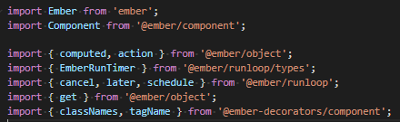
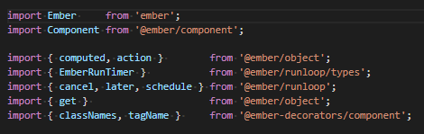

# VirtualAlign README

A VS Code extension to align code visually without modifying source. 
Currently supports aligning `import` declarations in Javascript and Typescript files.

## Features

With code like this:  

VS Code will display this:  

## Requirements

None.

## Extension Settings

None yet!

## Known Issues

None!

